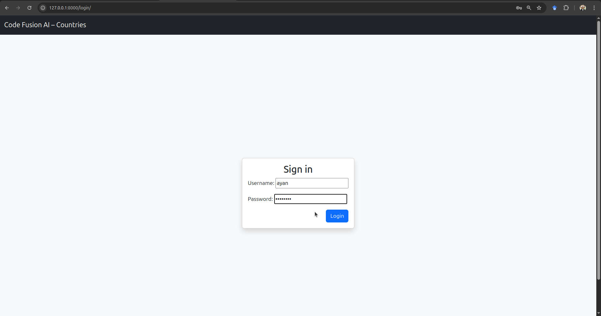
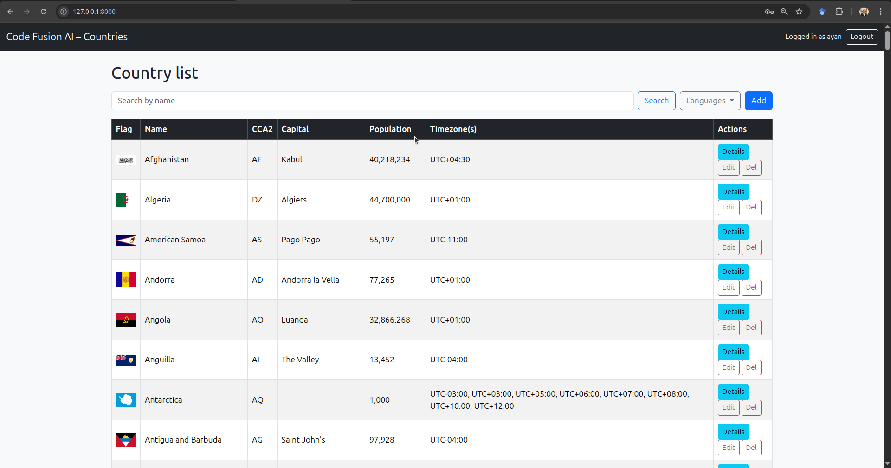
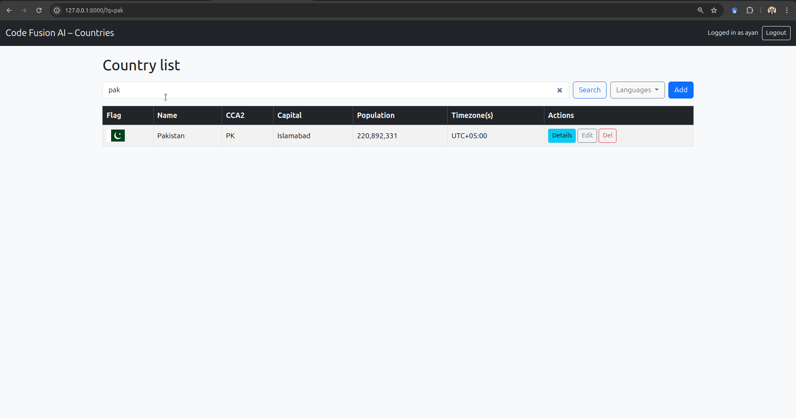
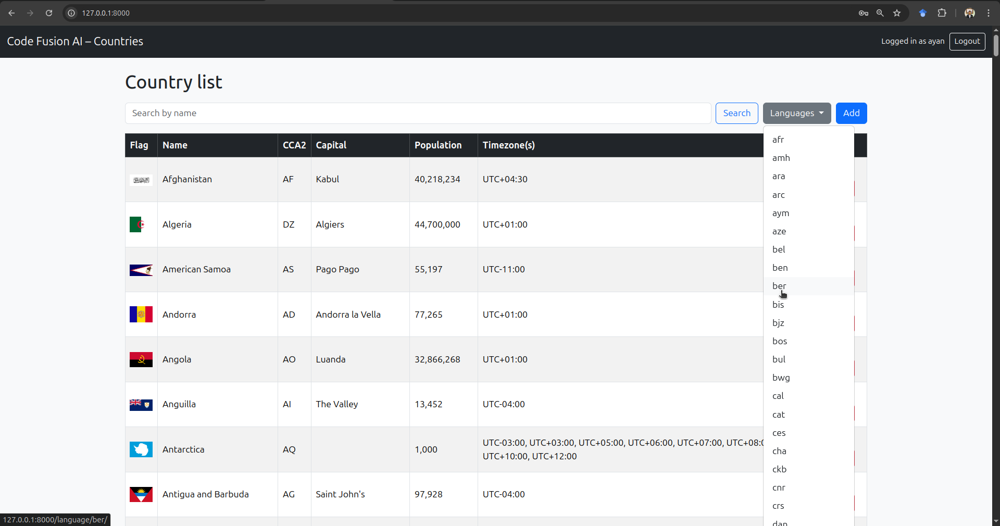
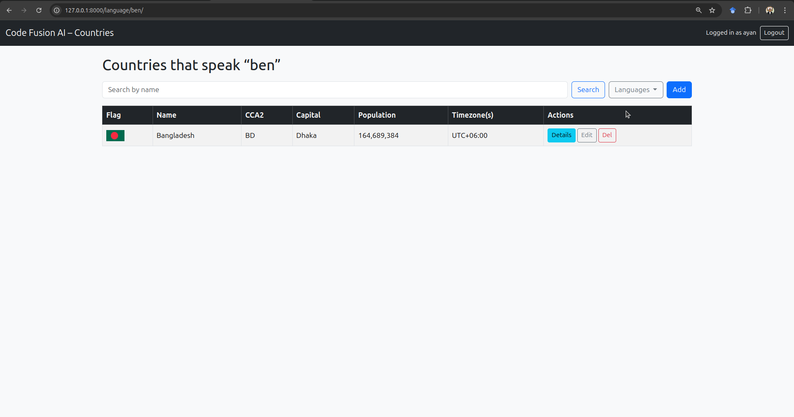
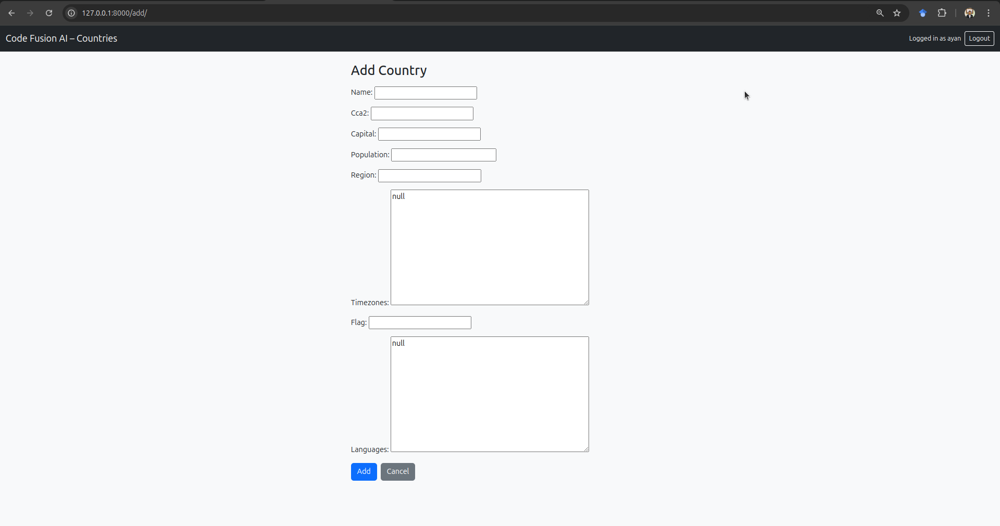
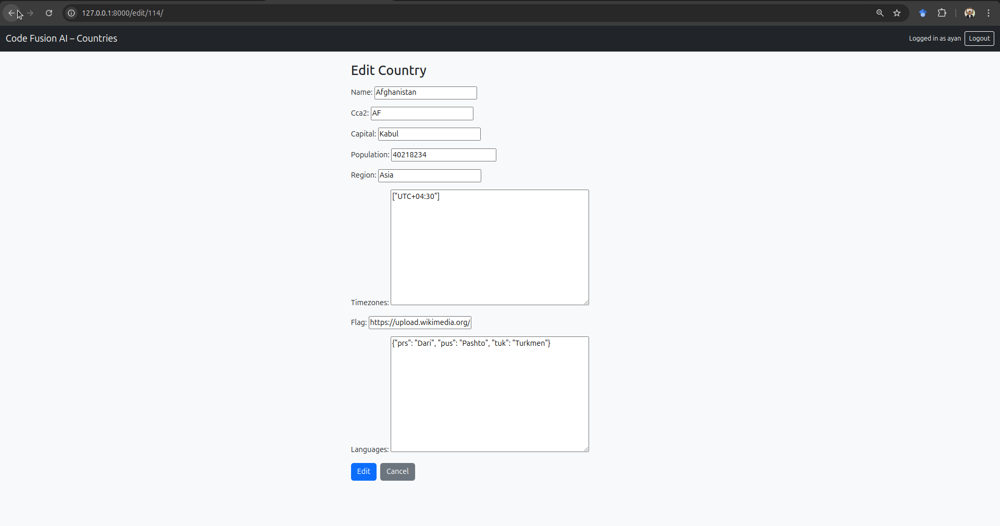
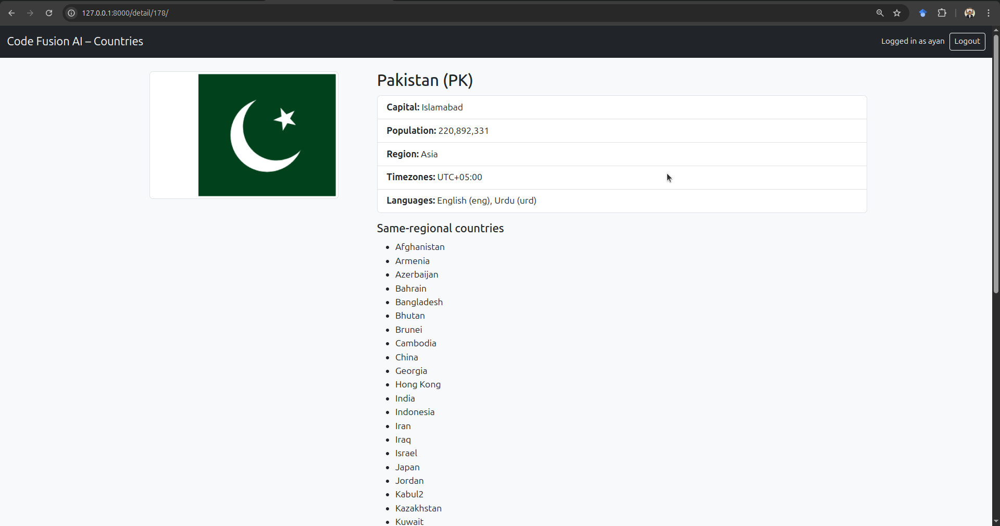

# CodeFusion AI – Country Information Service  
*Python Developer Assignment – May 4 2025*

**Django | Django REST Framework | Bootstrap 5**

</div>

---

## 1  Overview  

A full-stack Django application that

* fetches country data from **https://restcountries.com/v3.1/all**,  
* stores it in a relational database,  
* exposes a secure REST API, and  
* renders a Bootstrap web UI for authenticated users.

> **Goal**: Allow users to browse, search, and manage country records – including regional and language-based filters – while demonstrating production-ready Django practices.

---

## 2  Assignment Phases & Implementation

| Phase | Requirement (from spec) | Where Implemented |
|-------|-------------------------|-------------------|
| **1 – Data Fetch & Storage** | New project/app, fetch API, create models, management script | `codefusionapp/models.py`, `management/commands/fetchcountries.py` |
| **2 – REST API** | CRUD + regional + language + search endpoints | `views.py (CountryViewSet)`, `api_urls.py` |
| **3 – Web Interface** | Bootstrap table, search box, Languages dropdown, Details, Add/Edit/Delete | `templates/codefusionapp/`<br>`countries.html`, `detail.html`, `form.html`, `confirm_delete.html` |
| **4 – Auth & Security** | Login page, restrict API & UI to authenticated users | `LoginView` route, `@login_required`, DRF default permission `IsAuthenticated` |

---

## 3  Tech Stack

| Layer          | Library / Tool        | Notes |
|----------------|-----------------------|-------|
| Backend        | Django 4.2, DRF 3.14  | Core framework + REST APIs |
| DB driver      | `psycopg2-binary`     | PostgreSQL (SQLite fallback for dev) |
| Frontend       | Bootstrap 5           | Responsive UI |
| Tests          | pytest-django         | API and management-command coverage |

---

## 4  Setup & Installation

> **Prereqs**: Python 3.9+ (tested on 3.12), Git, virtual-env, PostgreSQL (optional).

```bash
git clone https://github.com/mominulislam2001/CodeFusionAI-Task.git
cd CodeFusionAI-Task
python -m venv venv && source venv/bin/activate
pip install -r requirements.txt

python manage.py makemigrations
python manage.py migrate

python manage.py fetchcountries

python manage.py createsuperuser   
python manage.py runserver

```

Screenshots

<div align="center">

### Login



### All Countries (main table)



### Search by Country Name



### Filter by Language




### Add Country Form



### Edit Country



### Details & Same-Region (example)



</div>


pip install -r requirements.txt
# edit SECRET_KEY & DB settings as needed
